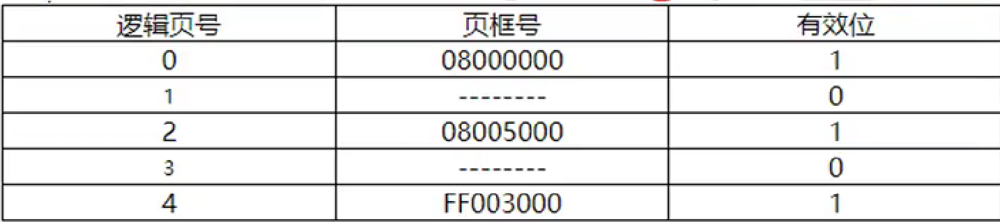
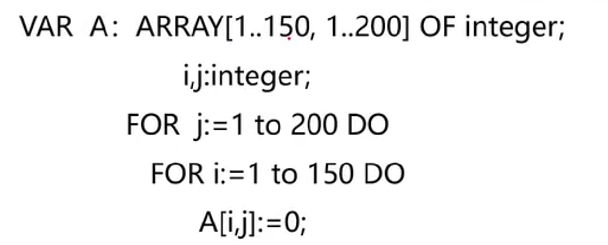

<a id="mulu">目录</a>
<a href="#mulu" class="back">回到目录</a>

<!-- @import "[TOC]" {cmd="toc" depthFrom=3 depthTo=6 orderedList=false} -->

<!-- code_chunk_output -->

- [操作系统的分类（单选+多选）](#操作系统的分类单选多选)
- [操作系统的结构（单选+多选）](#操作系统的结构单选多选)
- [中断与异常（单选较多）](#中断与异常单选较多)
- [系统调用与一般过程调用](#系统调用与一般过程调用)
- [进程状态模型](#进程状态模型)
    - [三状态进程状态模型](#三状态进程状态模型)
    - [五/七状态进程状态模型](#五七状态进程状态模型)
- [Pthread线程包](#pthread线程包)
- [进程调度算法](#进程调度算法)
- [并发与同步](#并发与同步)
    - [进程同步与互斥](#进程同步与互斥)
    - [生产者消费者](#生产者消费者)
    - [进程通信方式](#进程通信方式)
- [内存管理](#内存管理)
    - [页式内存分配](#页式内存分配)
    - [分配算法](#分配算法)
    - [页表项](#页表项)
    - [页面置换算法](#页面置换算法)
    - [可变分区](#可变分区)
    - [地址和偏移指针](#地址和偏移指针)
    - [地址构成](#地址构成)
    - [访问时间](#访问时间)
    - [程序缺页中断次数](#程序缺页中断次数)
    - [存储方式产生碎片](#存储方式产生碎片)
    - [磁盘块置零](#磁盘块置零)
- [文件管理](#文件管理)
    - [文件占多少个磁盘块](#文件占多少个磁盘块)
    - [文件最大块/尺寸](#文件最大块尺寸)
    - [物理块对应的索引表](#物理块对应的索引表)
    - [目录项分解的平均/最大访盘次数](#目录项分解的平均最大访盘次数)
    - [读取文件的访盘次数](#读取文件的访盘次数)

<!-- /code_chunk_output -->

<!-- 打开侧边预览：f1->Markdown Preview Enhanced: open...
只有打开侧边预览时保存才自动更新目录 -->

操作系统原理+计算机网络
每部分单选30+多选10，多选错选漏选没分
多选题里面的计算题和技巧题比较简单，占10'左右
### 操作系统的分类（单选+多选）
并发：多个事件在**同个**设备上同时发生
并行：在**不同**的设备上运行
互斥共享：各用户不能同时使用某个资源
同时共享：可以一起使用
**批处理操作系统**：
- **特点**：成批处理，可并发；用户不能干预；增加软件开发时间，适用于成熟程序；用于作业调度，不用于进程调度
- **优点**：自动化程度高、资源利用率高、吞吐量大、提高整个系统效率
- **缺点**：无法交互，不适合调试程序
- **应用**：处理薪水册、货物清单、各类账目等

**分时操作系统**：及时响应用户输入的**交互**命令
- **多路性**：多个用户同时使用一台计算机（宏观上多个人同时使用CPU，微观上多个人不同时使用）
- **交互性**：用户可以直接干预（根据系统响应提出请求），便于调试
- **独占性**：每个用户都感觉好像整个系统被他独占，资源利用率较低
- **及时性**：系统能够及时响应用户请求

**实时操作系统**：在严格**时间**范围内，对外部请求作出反应
- **过载防护**：可以在大量突发的实时任务中，找到最重要的任务，之后延后或清除次要任务，保证最重要的任务成功执行
- **可靠性高**：有很强的健壮性和坚固性

**易错点**：
- *运行速度快、成本低* 都是相对概念，需要根据具体情况，不能作为某种操作系统的特点
- *系统资源利用率(CPU利用率)高* 是批处理的，其它操作系统都没有这个特点
### 操作系统的结构（单选+多选）
**整体式结构**：大模块分为多个小模块
- **优点**：结构紧密、接口简单直接、系统效率较高
- **缺点**：
  - 模块间转接随便、**独立性差**，系统**结构不清晰**
  - 数据作为**全程量**处理，可被任何程序存取修改，**并发性差**，系统不稳定
  - **适应性差**

全程量：运行过程中不能更改模块/数据，在整个过程中都使用同一个
**层次结构**：**单向依赖**（上一层模块功能和资源基于下一层，也可以说上一层功能是下一层的扩充延续），**调用不同层**模块接口
- **优点**：
  - 整体问题**局部化、模块化**
  - 模块间**结构和依赖清晰**
  - **可读性、适应性、可靠性高**
  - 可增加/替换某层，同时不影响其它层，**易于调试**、修改、扩充和维护，保证正确性和稳定性
- **缺点**：
  - 模块**功能单一**
  - 系统**规模较大**

**微内核（客户机/服务器）结构**：
- **特点**：有两种内核
  - **核心态内核**：采用**层次结构**构成操作系统（微内核）
  - **用户态内核**：进程层以**客户机/服务器方式**运行
- **优点**：
  - **可靠**：分支自包含、耦合松散（局部错误不影响整体）
  - **灵活**：接口规范，便于维护
  - **分布式处理**：不同服务可运行在不同处理器上
- **缺点**：**效率低**（所有用户进程只能通过微内核通信，通信不便捷）
### 中断与异常（单选较多）
中断是由**外部事件（异步事件）**引发的，异常是由**正在执行的指令**引发的
**中断类型**：
- **I/O中断**：由I/O设备的控制器或通道引起，分为正常结束和异常结束，例如网卡数据缓冲区满、点击鼠标
- **时钟中断**：计时器产生，包括维护软件时钟、处理器调度、控制系统定时任务、实时处理
- **硬件故障中断**：硬件引起，需要保存现场并提供诊断信息，例如存储器校验错
- **控制台命令**

**异常类型**：
- **程序性中断**：**指令**出错/越权/寻址越界引发，包括算术溢出、被零除、目态（用户态）程序执行**非法指令**、**内存**保护出错（访问禁止访问的存储位置）、**虚拟存储器**缺页、xx**进程**出错
- **系统服务请求中断/访管中断**：处理器专用指令（访管指令）引发

只要出现*指令* 就是异常
补充：
- 核心态/系统态（管态）：操作系统有权限执行的
- 用户态（目态）：用户有权限执行的
- 目态切换到管态：通过中断和异常
- 管态切换到目态：修改程序计数器(PSW)
### 系统调用与一般过程调用
注：**一般过程调用**可简写为**一般调用**/**过程调用**
**区别**：
- 系统状态
  - **一般过程调用**：调用程序与被调用程序在**相同状态**，不涉及系统状态转换，允许直接调用
  - **系统调用**：**调用程序在用户态**，**被调用程序在系统态**，需要**系统状态转换**，不允许直接调用
- 返回问题
  - **一般过程调用**完成后，**直接返回到调用过程**
  - **系统调用**完成后，对进程进行优先级分析，可能重新调度，即**先运行调度程序再返回到调用过程**
- 嵌套调用：**系统调用的深度受限**，不能一直进行嵌套

**系统调用分类（较少考）**：
- **进程控制**：创建/终止进程、获得/设置进程属性
- **进程通信**：进程间传递消息/信号
- **文件操作**：创建/打开/关闭/读写文件、创建目录
- **设备管理**：请求/释放/启动设备
- **信息维护**：获得当前时间日期、设置文件访问权限/修改时间
### 进程状态模型
共分为三/五/七状态，其中**三状态是最基本的**
##### 三状态进程状态模型
- **运行状态**：进程已获得CPU，并在CPU上执行（**占用CPU**）。在单CPU系统中，只有一个进程处于运行态
- **就绪状态**：进程已具备除CPU以外的运行条件（**未获得CPU**），处于就绪状态的进程可以有多个
- **等待/阻塞/封锁状态**：进程因等待某种事件发生而暂时不能运行，处于等待状态的进程可以有多个

**状态间的转换**：由操作系统完成，对用户透明（用户不知道处于哪个状态），体现进程的动态性
{:width=200 height=200}
- **就绪**状态通过**进程调用**（已最高优先级进入就绪队列）变为**运行**状态
- **阻塞**状态在**等待的事件发生**后变为**就绪**状态
  例如操作完成、申请成功
  唤醒原语`wakeup()`
- **运行**状态在分配的**时间片用完**（如需要的数据已准备就绪）后变为**就绪**状态（在时间片算法中）
- **运行**状态还可能因等待某个**事件发生**变为**阻塞**状态
  例如内存不足/溢出、需要的数据缺失、申请系统服务或资源、通信、I/O操作

注：
- 阻塞状态必须先变成就绪状态，才能进入运行状态。不可能直接从阻塞到运行
- **进程终止**：出现**中断或异常**，不包括设备忙（被临时占用）
- **抢占式调度系统**：在就绪队列中，谁的**优先级**高，就可以**抢占CPU**
##### 五/七状态进程状态模型
五状态相比于三状态多了**创建**和**结束**两个状态
{:width=200 height=200}
- 结束分为**正常退出**和**异常退出**
  异常退出：进程执行超时、内存不足、非法指令或访问地址、I/O操作失败、被其它进程终止
- 运行->结束：释放CPU及相关资源

七状态又多了**就绪挂起**和**阻塞挂起**状态
{:width=300 height=300}
- 就绪状态：进程在内存，可立即进入运行状态
- 阻塞状态：进程在内存，并等待某事件发生
- 就绪挂起状态：进程在外存（磁盘），只要进入内存即可运行
- 阻塞挂起状态：进程在外存（磁盘），并等待某事件发生

**挂起状态的作用**：如果一个进程申请的内存资源长时间不能得到满足，就可以将该进程调为挂起状态（挂起该进程）
注：考试中可能会问哪两个状态可以相互切换，就看上图中的箭头，如果没有箭头指向就不能相互切换
**相关题**：
- 一个进程的哪种状态变化必然会引起另一个进程的状态改变
  **运行状态->阻塞状态**
  因为一个进程从运行到阻塞会让CPU空出，这时另外一个进程就可以变成运行状态
- 系统改变进程状态使用哪种方法
  调用**进程控制原语**，例如上面提到的唤醒原语
- 抢占式调度系统中，进程从运行变成就绪的原因
  - 被调度程序抢占处理机(CPU)
  - 时间片用完
  - **进程创建完成**
  
  没有等待事件/等待的事件发生，注意“进程创建完成”其实也是，因为CPU的状态发生改变
### Pthread线程包
Pthread是基于IEEE标准1003.1定义的线程包，大部分UNIX系统都支持

| 线程调用                         | 返回值类型 | 返回值含义             | 描述                                   |
| -------------------------------- | ---------- | ---------------------- | -------------------------------------- |
| `pthread_create`                 | int        | 新线程id               | 创建一个新线程                         |
| `pthread_exit`                   | void       |                        | 结束调用的线程（使线程运行后主动退出） |
| `pthread_join`                   | int        | 0：成功 非0：错误号 | 等待一个特定的线程退出                 |
| `pthread_yield`                  |            |                        | 释放CPU以运行另一个线程                |
| `pthread_attr_init`（考的少）    | int        | 0：tid 非0：错误号  | 创建并初始化一个线程的属性结构         |
| `pthread_attr_destroy`（考的少） | int        | 0：成功 非0：错误号 | 删除一个线程的属性结构                 |

注：当创建一个线程时，会输出一条信息，然后退出。这些信息的输出顺序不确定，并可能在连续运行程序的情况下改变。比如给一段程序，它理论上会依次输出`1`-`2`-`3`-`4`，但选项中只有`1`-`2`-`4`-`3`，就选这个，因为顺序不确定

特殊题型：
- 当`pthread_xxx`运行成功后，该进程有多少个线程？
  `pthread_exit`是1个线程，其它(join/create/yield)都是2个
- 程序运行中最多存在几个线程？**2个**（一个主线程一个子线程）
### 进程调度算法
- **先来先服务/先进先出(FCFS)**：适用于**作业调度和进程调度**，是最简单的**非抢占式**算法，属于**公平算法**
  - 方式：按请求的CPU顺序使用CPU
  - 优点：易于理解、使用便捷
  - 缺点：没考虑进程的实际需要
- **最短作业优先(SJF)/短作业优先**：适用于**作业调度**，是可以预知运行实际的**抢占式/非抢占式**批处理调度算法
  到达时间短的先运行，如果到达时间相同，就是运行时间短的先运性
- **最短剩余时间优先(SRTN)**：适用于**作业调度**，是最短作业优先算法的**抢占式**版本。选择剩余运行时间最短的进程运行
- **最高响应比优先算法(HRRF)**：适用于**作业调度**，选择响应比最高的作业运行
  {:width=50 height=50}
  - 优点：提高调度公平性和效率
  - 缺点：消耗系统资源
- **轮转法/时间片(RR)**：适用于**进程调度**，属于**公平算法**。将CPU处理时间分成多个时间片，就绪队列中进程轮流运行一个时间片
  **时间片值设置影响因素**：系统响应时间(T)、就绪进程数、计算机处理能力
- **最高优先级算法(HPF)**：适用于**作业调度和进程调度**，**可抢占式/不可抢占式**均可。将处理机分配给有最高优先级的就绪进程
- **多级反馈队列算法**：适用于**进程调度**，综合了先进先出、时间片和可抢占式最高优先级算法

**总结（重点）**：
{:width=400 height=400}
注：
- 实时系统调度算法需要单独记
- 短作业优先包括最短作业优先和最短剩余时间优先，不同于最短进程优先

例题：
- **哪种调度算法不可抢占/是公平算法/考虑公平因素**：如果是单选，就优先选**先来先服务**，没有再选**时间片轮转**；如果是多选就选这两个
- **哪些调度算法与时间有关**：除了高优先级优先
- **周转时间少的算法适用于哪种系统**：**批处理系统**（对系统效率要求高的）
- **计算：平均周转时间**
  - **例1**：4个作业同时到达，运行时间分别为8/4/4/4分钟，采用短作业优先算法或先来先服务
    {:width=200 height=200}
    B/C/D运行时间较短，先运行，开始/结束时间就是按B->C->D->A的顺序计算，周转时间=结束时间-到达时间，平均周转时间=(20+4+8+12)/4=11
    {:width=200 height=200}
    按A->B->C->D的顺序，平均周转时间=(8+12+16+20)/4=14
  - **例2**：5个作业，运行时间分别是2/4/1/1/1，到达时间分别是0/0/3/3/3，短作业优先算法
    {:width=150 height=150}
    虽然BDE的运行时间短，但开始时它们还没到达，所以只能选择A/B，其中A的运行时间短，因此按A->B->C->D->E的顺序运行，平均周转时间=(2+6+4+5+6)/5=4.6
- **计算：响应比**
  一个作业预计运行20分钟，在到达系统后经过20分钟等待后才被调度
  (20+20)/20=0.5
### 并发与同步
##### 进程同步与互斥
- 进程同步：流水线工作，相互配合
- 进程互斥：有你没我

**例1：哪一个只存在进程同步关系**
- 不同用户访问同个订票数据库--互斥（不能买同一个座）
- 不同用户在**各自**的电脑上联机玩游戏--同步
- 不同用户在**同一台**电脑上联机玩游戏--同步+互斥（不能同时操作）
- 不同用户在**各自**电脑上写**独立**程序--没有关系（既不同步也不互斥）

**例2：篮球比赛中队员关系**
- 双方队员间：互斥
- 我方队员间：同步

**例3：读取数据/处理数据/打印结果进程的关系**——同步

---

**临界资源**：在一个时间段内只能被一个人访问，例如订票系统中的票（不是订票人）
**进程访问临界区的准则**：空闲则进、忙则等待、让权等待（权限不同）
**测试与设置指令(Test&Set, TS)**：True/1-占用，False/0-空闲
- 检测W值，W=1：返回重新测试
- 检测W值，W=0：置位W=1，进入临界区
- 退出临界区：复位W=0

**例：临界资源访问的是哪个区**
{:width=200 height=200}
- `while TS(%lock)`：进入区
- `n=fetch(balance)`：临界区
- `lock=False`：退出区
- `output(n)`：剩余区
##### 生产者消费者
**生产者**：向缓冲区中放东西
**消费者**：从缓冲区中拿东西
**P/V操作**：P是申请，V是释放
- 生产者向缓冲区中放产品前要先使用P操作确保缓冲区有空闲槽
- 消费者从缓冲区中拿产品前要先使用P操作确保缓冲区有产品（不是互斥使用）
- 生产者与消费者之间：同步+互斥
- 生产者之间/消费者之间：互斥

**例：有N个缓冲区的生产者消费者问题**
- **信号量mutex**：初值为1
- **信号量empty**：初值为N
- **信号量full**：初值为0
- **生产者**：`P(empty)`->`P(mutex)`->`V(mutex)`->`V(full)`
- **消费者**：`P(full)`->`P(mutex)`->`V(mutex)`->`V(empty)`

注意：**P操作顺序不能颠倒，V操作可以**
##### 进程通信方式
**共享内存**：两个进程对内存**一个写一个读**，不在系统中产生相同拷贝
**消息机制**：内存中开辟**缓冲区**
**信箱通信**：双方**不直接建立联系**，接收可以不同时（**异步收发**邮件），无时间限制
- 邮件槽满时不能申请互斥锁

**管道通信**：大量、文件管理、**共享文件**、正确的同步和互斥
### 内存管理
##### 页式内存分配
有效位为1表示该页在内存、为0不在；逻辑地址是16进制(0x0E8D)，表示外存；物理地址是内存
- **逻辑地址=页号+业内地址**
  题中会给定页面大小，例如页面大小=4096B=2^12^，就说明逻辑地址的二进制的后12位是页内地址，前面4位是页号
- 将页号变为十进制，**页号对应的有效位为0，则发生缺页中断**

例：页面大小4096B，逻辑地址为`0x0E8D`/`0x3010`/`0x411B`/`0x00FB`/`0x231E`，给定
{:width=100 height=100}
- 16进制的第一个数是页号，分别为0/3/4/0/2
- 对应的有效位分别为1/0/1/1/1
- 共有1次缺页中断
- 如果页面大小是8192B，就要先转成2进制，之后取前3位作为页号
- 如果页面大小是0x1000B，就是1*16^3^=2^12^
##### 分配算法
- **最佳适配**：找到能满足内存申请的最小空闲区
- **最差适配**：找到能满足内存申请的最大空闲区
- **首次适配/最先适应**：找到第一个能满足内存申请的空闲区
- **下次适配**：多个进程可以分配到同一个存储空间内，与指针位置有关
  - 注：前3种都是从头开始找，只有下次适配是从指针停留的那一块内存开始找

**例1：采用的是什么分配算法**
{:width=200 height=200}
- 第一个表是分配前的，第二个是分配后的
- 先把分配前的表中状态为未用的标记一下
  - 如果是最佳分配：选择5K和25K的内存（位置为100K/135K）
  - 如果是最差分配：选择30K和25K的内存（位置为20K/135K，20K的进程分配到地址为20K的内存，5K的进程分配到地址为135K的内存）
  - 如果是首次分配：选择位置为20K和100K的内存
  - 如果是下次分配：只用位置为20K的内存（两个进程存到一块内存中）
- 再看哪个内存在分配后的表中被占用：该题中地址为20K和135K被占用，因此是最差适配

**例2：进程分配到哪个内存块**
分配指针在序号9，创建一个16K进程，采用以上4种算法，分配到哪块内存
{:width=400 height=400}
**从标志为NULL的里面找**
- 最佳适配：7
- 最差适配：18
- 首次适配：5
- 下次适配：从序号9开始找，16
##### 页表项
- **页框号**：内存号
- **有效位**：是在内存还是外存，决定产生缺页中断
- **修改位**：是否被修改过
- 访问位：是否被访问过
- 保护位：如果没有权限，可能产生中断
- 禁止位：内存映射到I/O设备

**虚拟地址到物理地址转换**：即从外存调入内存中
- 页表项在内存，**正常转换**
- 页表项不在内存，产生**缺页中断**
- **快表命中**：快表相当于高速缓存，如果能在快表中找到，就**正常转换**，不需要再向内存中找
- **页表命中**：快表中没有，到内存中找，同时**更新快表**
##### 页面置换算法
- **最近最不常用(LFU)**：置换**访问次数最少**的
- **最近最少使用(LRU)**：置换**访问位为0**中**调入内存时间最早**的
- **最近未使用(NRU)**：置换**访问位和修改位均为0**的中**调入内存时间最早**的
- **先进先出(FIFO)**：置换**调入内存时间最早**的

**例：置换哪个页面**
{:width=100 height=100}
- LFU：页号22-页框号AB85
- LRU：页号15-页框号EB78
- NRU：页号34-页框号DC26
- FIFO：页号11-页框号68BF
##### 可变分区
修改内存分配表：指定进程退出后，
- 如果它上下的内存标志都为NULL，就把上下分区合并
- 如果只有上为NULL，就与上分区合并
- 如果只有下为NULL，就与下分区合并
- 如果上下都不为NULL，就不进行合并操作

{:width=200 height=200}
- P1退出：与上合并
- P2退出：不合并
- P3退出：与下合并
- P4退出：与上、下合并
##### 地址和偏移指针
算某个地址的页目录/二级页表/三级页表/业内偏移量的偏移指针
{:width=50 height=50}
- 如果给的是16进制的指令地址，就先转成2进制
  {:width=30 height=30}
- 上面的表格表示页表占几位，从地址的第1位开始数
  - 页目录：1-6位
  - 二级页表：7-16位
  - 三级页表：17-26位
  - 页内偏移量：27-40位
- 三级页表对于的二进制为`0110100101`，转成16进制即为结果`1A5`
  二级页表对于的二进制为`1110111100`，转成16进制即为结果`3BC`

注：
- 16进制转二进制：每个数拆成4位
- 二进制转16进制：在前面补0，每4位数合成1位
- 如果表格内给的是xx位移，计算方法与上面相同
  比如表格里是页位移，问的是页地址（页内地址）；或者表格里是页内地址，问的是业内偏移量
##### 地址构成
{:width=150 height=150}
- 进程最大的字节：2^逻辑地址^
- 进程最大的页面：2^页号^
- 每个页面的字节：2^页内地址^

如果题中还说“每个地址**可以访问**n个字节”
- 进程最大的字节：2^逻辑地址^\*n
- 进程最大的页面：2^页号^
- 每个页面的字节：2^页内地址^\*n

如果题中还说“每个地址**访问**n个字节”
- 进程最大的字节：2^逻辑地址^\*n
- 进程最大的页面：2^页号^**/n**
- 每个页面的字节：2^页内地址^\*n

例1：采用32位二进制表示逻辑地址，页内地址占14个二进制位
- 进程最大的字节：2^32^
- 进程最大的页面：2^18^
- 每个页面的字节：2^14^

例2：**每个地址可访问4个字节**，采用24位二进制表示逻辑地址，页内地址占10个二进制位
- 进程最大的字节：2^26^
- 进程最大的页面：2^14^
- 每个页面的字节：2^12^

例3：**每个地址访问4个字节**，采用64位二进制表示逻辑地址，页内地址占12个二进制位
- 进程最大的字节：2^66^
- 进程最大的页面：2^50^
- 每个页面的字节：2^14^

补充：题中还有可能会说“每个地址对应寻址一个字”，它相当于“每个地址可以访问2个字节”（一个字=2个字节；寻址=可以访问）
##### 访问时间
给定访问内存的时间为400、访问快表的时间为40、快表的查找命中率为90%
- 使用快表的平均访问时间=(400+40)\*90%+(400+400)\*10%=476
- 不使用快表访问内存的时间=400\*2=800
- 指令的平均访问时间降低百分比=(不使用快表-使用快表)/不使用快表=(800-476)/800\*100%=40.5%
##### 程序缺页中断次数
一个页面可以存放300个整数变量
{:width=150 height=150}
缺页次数=`i`\*`j`/`页面存放整数变量数`=300\*200/300=200
- i和j为循环次数，如果是`i=0 to 2047`，i就为2048
- 注意：`页面存放整数变量数`如果写成`每页大小为多少字节`，就需要根据题中变量和字的换算关系（一般为每个变量占1个字），转为整数变量数

例：每页大小为4096字节，每个变量占用1个字
{:width=120 height=120}
- 一个字=2字节，因此4096字节=2048个变量
- 次数=2048\*2048/2048=2048

变形：一个页面150个变量，但循环中是先j再i，就要看`页面存放整数变量数`与i或j的倍数关系（1倍/2倍/4倍等），次数=i\*j/倍数
{:width=150 height=150}
页面大小150=i，倍数为1，因此次数=150\*200
##### 存储方式产生碎片
**外部碎片**：在进程之外产生，**未分配**，不属于任何进程
- （虚拟）段式、可变分区

**内部碎片**：**已经分配**完成，但无法被利用
- （虚拟）页式、段页式、固定分区
##### 磁盘块置零
设归还块的块号为i，要将m行n列置零，表格中除第一列的列数为a
- m=[i/a]（i除a后取整）
- n=i%a（i对a取模）

例：归还号为30的块
{:width=150 height=150}
- 0-15共有16列，a=16
- m=[30/16]=1
- n=30%16=14
- 因此将1行14列置零
### 文件管理
8bit=1B
1KB=1024B
##### 文件占多少个磁盘块
文件大小/磁盘块大小
##### 文件最大块/尺寸
I节点包含13个地址项，0-9为直接地址，10为一级索引，11为二级索引，12为三级索引，磁盘块大小4096B，地址项占4B，文件最大块/尺寸？
- 4096/4=1024=2^10^   
- n级索引就是(2^10^)^n^
- 最大块=直接地址数+n级索引数=10+2^10^+2^20^+2^30^
- 最大尺寸=最大块\*磁盘块大小=(10+2^10^+2^20^+2^30^)\*4096

例：物理块大小为1KB，32位表示一个物理块号，0-9为直接地址，10为一级索引，11为二级索引，12为三级索引，文件最大块数？
1KB=1024B  32位=4B
1024/4=256
最大块=10+256^1^+256^2^+256^3^
##### 物理块对应的索引表
就是从直接块地址开始数数
{:width=250 height=250}
查找块号为10的物理块：直接块有4个，一级地址指针包含128个指针，所以该物理块在一重间接盘块中
- 块号为144：二重间接盘块
##### 目录项分解的平均/最大访盘次数
分为**目录项分解前**和**目录项分解后**，如果选项中有2个数很大、2个数很小，如果问的是分解前，就把两个小的排除；如果问的是分解后，就把两个大的排除
每个盘块a字节，文件控制块b字节，文件名c字节，假设一个目录文件共有d个文件控制块
- 一个物理块存放文件控制块数n=a/b
- 分解前最大访盘次数m=d/n，最小为1
- 分解前平均访盘次数=(1+m)/2
- 符号目录文件大小x=d*c/a
- 分解后最大访盘次数=1+x，最小为2
- 分解后平均访盘次数=(1+x)/2+1

例：
{:width=100 height=100}
分解前：
- 最大访盘次数=(256/(512/64))=32
- 平均访盘次数=(1+32)/2=16.5

分解后：
- 符号目录文件大小=256*8/512=4
- 最大访盘次数=1+4=5
- 平均访盘次数=(1+4)/2+1=3.5
##### 读取文件的访盘次数
给定磁盘块大小、开始读取的位置和读取长度
- **链接结构**：算出读取结束的位置=开始读取的位置+读取长度，然后找读取结束的位置在第几块盘，在第几块盘就读几次
  例：磁盘块大小为4096字节，从12268字节开始读40个字节
  4>(12268+40)/4096>3，因此访盘次数为4
- **顺序结构**：看开始读取的位置和读取结束的位置区间，这个区间在几块盘内，就读几次
  例：每个物理块大小为4096字节，从12306开始读10个字节
  4>(12306)/4096>3  4>(12306+10)/4096>3
  因此[12306, 12316]都在第3块盘内，访问1次磁盘

注意：还有一种特殊情况，题中给定文件长度为n个磁盘块，如果算出的位置>n，就选`出错`
{:width=100 height=100}
- 如图，这个顺序结构的题没直接说文件长度，但看最右面标号为100，文件长度就是100

更复杂的形式：从该文件中读取12306起始的连续10个字节，以及从该位置后间隔200字节的连续16个字节，需要访盘几次
读取结束的位置=12306+10+200+16
