<a id="mulu">目录</a>
<a href="#mulu" class="back">回到目录</a>

<!-- @import "[TOC]" {cmd="toc" depthFrom=3 depthTo=6 orderedList=false} -->

<!-- code_chunk_output -->

- [基础](#基础)
    - [计算机网络基本概念](#计算机网络基本概念)
    - [参考模型](#参考模型)
    - [操作系统](#操作系统)
    - [交换方式](#交换方式)
    - [数据传输](#数据传输)
    - [拓扑结构](#拓扑结构)
    - [APRANET](#apranet)
    - [无线自组网](#无线自组网)
- [局域网](#局域网)
    - [有线局域网](#有线局域网)
    - [无线局域网WLAN](#无线局域网wlan)
    - [虚拟局域网VLAN](#虚拟局域网vlan)
    - [帧](#帧)
    - [带宽计算](#带宽计算)
    - [802.11标准](#80211标准)
    - [其它](#其它)
- [Internet](#internet)
    - [IP地址计算](#ip地址计算)
    - [下一跳步IP地址](#下一跳步ip地址)
    - [IP地址和默认路由](#ip地址和默认路由)
    - [IP数据报](#ip数据报)
    - [路由器NAT转换](#路由器nat转换)
    - [ARP缓存](#arp缓存)
    - [路由协议](#路由协议)
    - [其它](#其它-1)
- [Internet基本服务](#internet基本服务)
- [新型网络应用](#新型网络应用)
- [网络管理与安全](#网络管理与安全)
    - [网络管理](#网络管理)
    - [网络安全与加密](#网络安全与加密)
    - [各种协议](#各种协议)

<!-- /code_chunk_output -->

<!-- 打开侧边预览：f1->Markdown Preview Enhanced: open...
只有打开侧边预览时保存才自动更新目录 -->

### 基础
##### 计算机网络基本概念
- 基本特征/目的/功能：网络资源共享
- 是真实终端的集合，不是仿真终端
- 计算机间通信必须遵循相同网络协议
- 计算机间没有明确的主从关系
##### 参考模型
**OSI**：由7个层次构成，ISO制定

| 层次             | 作用                                       | 单位        |
| ---------------- | ------------------------------------------ | ----------- |
| 应用层（最高层） | 应用程序之间控制、域名解析                 | 数据单元PPU |
| 表示层           | 数据格式/加密                              | 数据单元PPU |
| 会话层           | 维持主机交流                               | 数据单元PPU |
| 传输层           | 端-端服务、进程通信(可靠的TCP/不可靠的UDP) | 报文        |
| 网络层           | 路由选择、差错控制、无介质                 | 分组        |
| 数据链路层       | 提供转发bit流                              | 帧          |
| 物理层（最底层） | 传输介质，**提供透明比特流传输**           | 比特序列    |

---

**TCP/IP**：由4个层次构成，独立于特定网络硬件，IETF制定，支持异构系统互联，出现于TCPIP协议后
| 层次                  | 作用                                       |
| --------------------- | ------------------------------------------ |
| 应用层 （最高层）     | 应用程序之间控制、域名解析                 |
| 传输层                | 端-端服务、进程通信(可靠的TCP/不可靠的UDP) |
| 互联网络层/互联层     | 路由选择、差错控制、IP分组                 |
| 主机-网络层（最底层） | 传输介质                                   |

与OSI的对应关系：
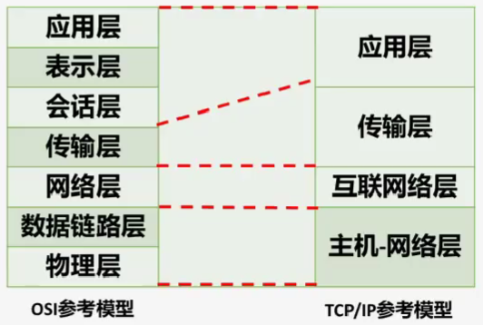{:width=300 height=300}
##### 操作系统
**Windows**：
- 由**微软Microsoft**开发维护
- 可在微型机环境中运行
- **闭源**
- **不基于POSIX**

发展历程：
- **NT：最早，不对等**
- **2000**：提供文件打印、Web服务等
- **XP(2001)**
- WIN server 2003：主要用于服务器（是Windows系统的服务器版本），提供图形用户界面
- WIN7(2009)：支持触控的桌面操作系统
- WIN8(2012)
- WIN10(2015)

---

**Linux**：
- **不是由IBM开发**（Unix才是IBM开发），不是国际组织维护
- 可用于客户端/服务端
- 开源，完全免费，内核至今仍在升级
- 一种网络操作系统
- 核心部分是不同版本的Linux内核
- Linux由Unix发展而来，但**不是Unix的变种**（采用的内核不同）
##### 交换方式
**虚电路**：
- 发送前，在源节点与目的节点间建立**逻辑连接**
- 顺序发送，不会出现乱序、重复、丢失
  源节点分组顺序和目的节点接收分组顺序一定相同
  每个分组必须按相同路径传输
- 不需要路由选择
- 数据分组时**不需携带源地址和目的地址**

**数据报**：
- 传输前**不需建立连接**
- 每组**传输路径可能不同**
- 传输时需进行存储转发
- 数据分组时**需要携带源地址和目的地址**
- 存在**乱序**、重复、丢失等问题，传输延迟大
- 适用于突发性通信，不适用于长报文、会话式通信和局域网
##### 数据传输
数据传输速率：每秒传输的二进制比特数（不是文字数）
- 单位是`bps`
- 单位换算每级差1000倍：T>G>M>K
  1**T**bps=10^3^**G**bps=10^6^**M**bps=10^9^**K**bps=10^12^bps
##### 拓扑结构
**网状**：无规则的结构
- 节点间**任意连接**、无规律，没有中心节点，节点间数据传输延时不固定
- 可靠性高
- 常用于广域网
- 较复杂，转发时使用**路由选择**算法、流量控制

**星形**：所有的普通节点都连接在**中心节点**上
- 中心节点控制全网通信，是全网的瓶颈，一旦损害，可能造成全网瘫痪
- **树状拓扑是星形的拓展**

**环形**：所有节点间形成一个**闭合环路**
- 数据沿环逐个节点传输，传输延时确定，**传输顺序固定**
- 节点间连接关系固定

**总线型**：所有节点传输时都要走同一条总线
- 使用CSMA/CD机制
- 总线是共享的传输介质
- 以广播方式发送数据
- 拓扑结构不变
##### APRANET
是ARPA支持的研究性网络，是所有网络的鼻祖
- 提出资源子网与通信子网的二级结构
- 采用**分组交换**，是**交换式**的局域网
- **网状结构**，**不对等**
- 传输介质是IMP（路由器）
- 是很早之前的技术，选项中出现现代技术词汇肯定不对（例如“智能终端”、“传感器网”、“无线自组网”）
##### 无线自组网
- 无中心结构
- 支持节点移动
- 不需要基础设施
- 拓扑结构不固定
- 无线传感器网(wsn)
  - 拓扑结构改变
  - 节点是传感器
### 局域网
##### 有线局域网
- 常用的传输介质：双绞线、光纤
- 最早的传输介质：同轴电缆(HFC)
  之后发展出：集线器、RJ45接口、非屏蔽双绞线
- 支持的最大传输速率：100Gbps
- CSMA/CD机制解决介质访问控制问题
- 数据帧：802.3帧，使用的地址是MAC地址

**分类**：
- **传统以太网**：是典型的总线型局域网，分为
  - 总线型
  - 令牌环网：采用环形拓扑
  - 令牌总线型
  
  令牌类网的介质访问控制方法是令牌，不是CSMA
  - 标准是802.3
  - 传输速率为10Mbps
- **快速以太网(FE)**：
  - 标准是802.3U
  - 传输速率为100Mbps
  - 定义了介质专用接口MII：分隔MAC层和物理层
- **千兆以太网(GE)**：
  - 标准是802.3Z
  - 传输速率为1Gbps
- **万兆以太网(10GbE)**：
  - 标准是802.3ae
  - 传输速率为10Gbps
  - 传输介质**主要是光纤**
  - 核心设备：交换机，**只采用双工模式**
  - **没有介质访问控制问题**（没有CSMA/CD技术），采用光纤通道技术
  - 可支持组建宽带**城域网、广域网**
- **40/100GbE**：
  - 标准是802.3ba
  - 传输速率为40/100Gbps
  - 传输介质只用光纤（前面几个都是光纤+双绞线）
  - 波分复用技术：一根光纤复用4路25Gbps

**共享介质以太网**：
- **核心设备：集线器**
- 使用CSMA/CD机制
- 数据传输时**可能发生冲突**
- 发现冲突时延时重发数据

**交换式以太网/局域网**：与无线局域网工作机制不同
- 核心设备：以太网**交换机**
  - 转发帧：直接转发、存储转发、改进直接转发
  - 使用端口/MAC地址映射表
  - 核心是交换机技术
  - 支持虚拟局域网
- 星形拓扑结构
- 使用**映射表控制介质访问（不是csma）**，不存在冲突问题
- 支持多对端口间**的并发传输**
- 基本传输单元：数据帧
##### 无线局域网WLAN
是有线局域网的补充
- 传输介质：无线电波（激光、红外线、微波等等）
- 仍**有介质访问控制问题**，使用CSMA/CA解决
- 包括无线自组网等
- 数据帧：802.11帧，使用的地址是MAC地址
- 标准是802.11
- 相关技术：
  - **跳频扩频技术FHSS**
  - **直接序列扩频DSSS**
    - 使用**ISM频段**(2.4GHz)
    - 最小传输速率：1/2Mbps
  - 点协调功能PCF
  - 分布式协调功能DCF
  - 虚拟监听VCS
##### 虚拟局域网VLAN
- **基于交换式局域网**（不是无线网络）
- **基于交换技术**
- 不受物理位置控制
- 定义成员节点：**IP/MAC地址**、**交换机端口**、**网络层协议**、**广播组**，没有集线器
##### 帧
只要是帧，就不涉及IP地址，**都是MAC地址**
**以太网帧**：
- 帧校验字段采用**32位CRC校验**（不是曼彻斯特编码），长度为**4字节**，校验包括目的/源地址、长度、数据
- **前导码和帧前定界符总长为8字节**
- **帧控制字段长度为2字节**
- **前导码：无信息**
- 帧数据字段：
  - **长度为46~1500B**
    如果题中说加上帧头（18字节），就是64~1518B
  - 保存高层协议类型，**为高层的待发送数据**
- 帧网络字段：表示**网络层协议类型**
- 帧类型字段：表示帧的类型（控制帧、管理帧等），**不是应用层协议类型**
- 分类：如果题中没说是哪种帧，默认为Dix
  - **Dix**：没有帧前定界符，前8字节都是前导码
  - **802.3**：前导码7/8字节，帧前定界符1字节
    帧前定界符不计入帧头长度
    **多选中说“前导码8/7字节” 帧数据字段1518/1500字节”都算对**

**802.11数据帧**：与上面的有部分不同
- 地址用**MAC**
- 数据字段：**0~2312字节**
- 地址字段：48位
- **顺序控制字段不控制持续时间**

802.3与.11：都是MAC
##### 带宽计算
总带宽=Σ端口数\*全双工端口带宽\*2（如果不是全双工就不乘2）
例：总带宽为12.8Gbps，有24个百兆全双工端口，则千兆全双工端口数最多为
- 24\*100Mbps\*2+x\*1000Mbps\*2=12.8Gbps
- 如果算出来的结果不为整数，则向下取整（确保不超过总带宽）
##### 802.11标准
**层次结构**
| 标准名(802.11x) | 频段                    | 最大传输速率(Mbps) | 兼容性    |
| --------------- | ----------------------- | ------------------ | --------- |
| a               | UNII-5GHz               | 54                 | 不兼容    |
| b               | ISM-2.4GHz              | 11                 | 不兼容    |
| g               | ISM-2.4GHz              | 54                 | 兼容b     |
| n               | UNII-5GHz ISM-2.4GHz | 600                | 兼容a/b/g |

##### 其它
**MAC（物理地址）**：
- 唯一
- 长度为48位（6个8节）
- 后3字节由厂家分配
- 存储于网卡中

**CSMA/CA**：
- 不需令牌，**与双绞线无关**
- **SIFS分隔各帧**
- 在**物理层**执行**载波侦听**功能
- 重发数据前**需等待**一段时间，**发送数据前侦听信道**
- 工作在WLAN的MAC层（不是VLAN），**支持MAC层的争用服务**

**CSMA/CD**：MAC层的介质访问控制方法
- 不需令牌，与无线AP无关
- **不用于交换式以太网**
- 发送数据的第一个步骤：**侦听总线**，不立即重传
### Internet
##### IP地址计算
已知IP地址和子网掩码
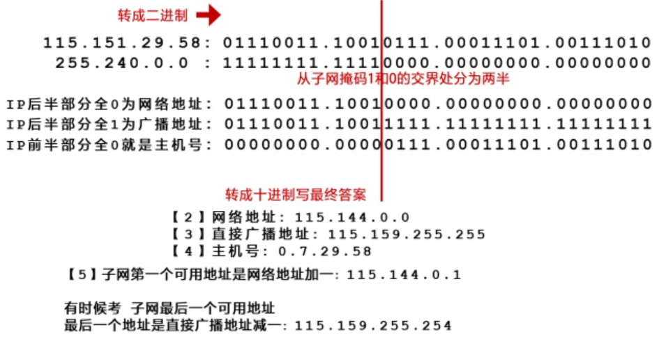{:width=300 height=300}
**网络号**：IP和子网掩码的二进制每位对比，若都为1则为1，反之为0
- 受限/有限广播地址（有线广播数据报）：固定为`255.255.255.255`
- ping收不到响应的原因：如果两个主机计算得到的网络地址不同，就是“处于不同的子网中”
- 一台主机的IP/掩码是xxx，移动到网络号（子网）为xxx的网络中：前半部分没用，计算时用移动后的IP和掩码
##### 下一跳步IP地址
第一种考法：单选题
- 把起始网络和目标网络连线，找路程中第一个路由器 靠起始点那边的IP地址

路由器2->`192.168.4.0`
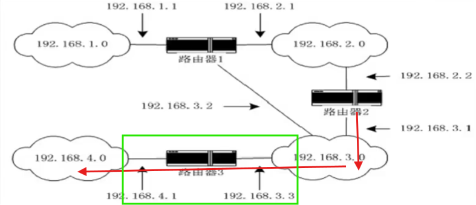{:width=200 height=200}
- 经过路由器3
- 靠起始侧的IP地址为`192.168.3.3`

---

第二种：多选
- 可行取值（可以为xxx）：一定能到达的（同单选题）
- 可能取值：所有与起始点相连的都算

路由器Q->`50.0.0.0`
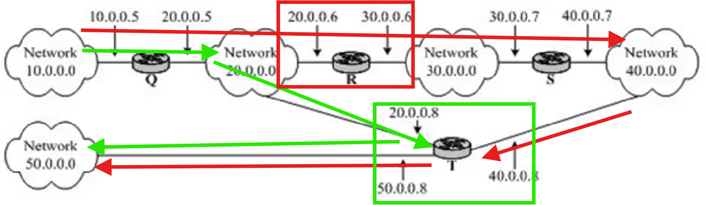{:width=200 height=200}
- 有两条路径都能到达目标，可行取值：`20.0.0.6`和`20.0.0.8`
- 与Q直接相连的只有R/T这两个路由器：可能取值与可行取值相同
- 如果在Q左侧再延伸出一个路由器，不与其它路由器相连（不能到达目标），它也算可能取值

路由器S->`50.0.0.0`
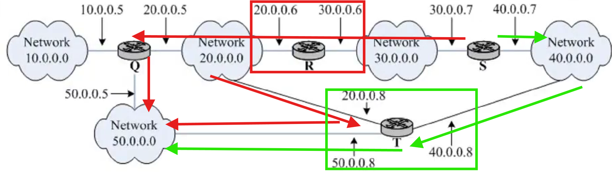{:width=200 height=200}
- 可能取值=可行取值：`30.0.0.6`和`40.0.0.8`
##### IP地址和默认路由
计算机F的IP地址和默认路由应设置为？
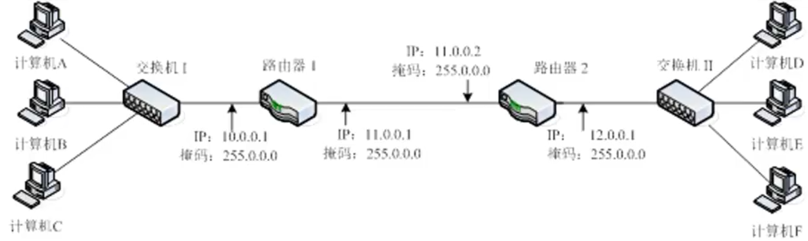{:width=200 height=200}
默认路由：离它最近的路由器的IP地址
IP地址：找与离它最近的路由器处于同一网段的
- 根据路由器2的IP和掩码求出可用网络地址
##### IP数据报
- 报头长度域的值：5
- 报头长度域的长度：20B
- 报头长度字段的值：报头长度(b)/32
- 数据报总长度字段：（报头长度+数据字段长度(b)）/8
- 报头长度域以32位双字位计量单位
- 头部校验只保证**报头**完整性
- 分片数据报中与原数据报一定相同：**标识字段**
- **不能保证可靠投递和正确接收**，**不可随意丢弃数据报**

**PC1向PC2发送IP数据报**
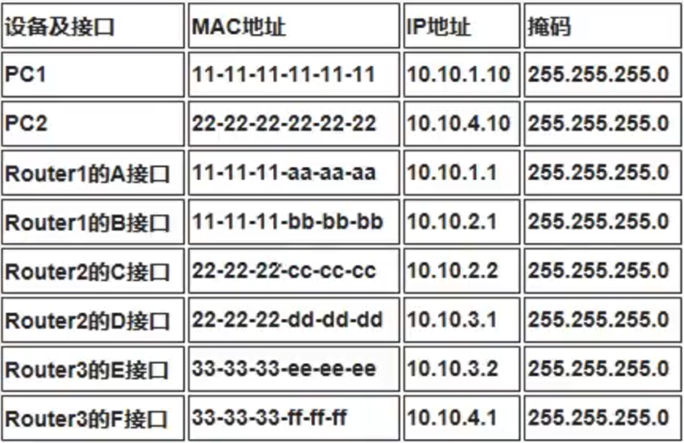{:width=300 height=300}
重点看设备和IP这两列
- 先把两个PC设备画出来
- 再把路由器接口和PC连线：网络地址相同的连在一起（其实这里可以直接看出来，`10.10.1.x`的为一组、`10.10.2.x`的为一组、...）

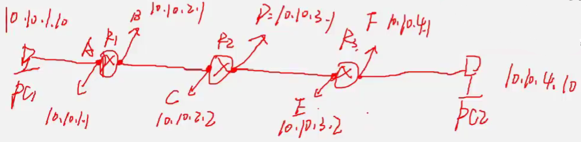{:width=150 height=150}
**IP地址固定不变**
- 源IP地址：PC1的地址
- 目的IP地址：PC2的地址

**MAC地址会改变**
- X接口发送的数据报：
  - 源MAC地址：X的MAC地址
  - 目的MAC地址：下一跳的MAC地址
- X接口收到的数据报：
  - 源地址：上一跳的MAC地址
  - 目的地址：X的MAC地址

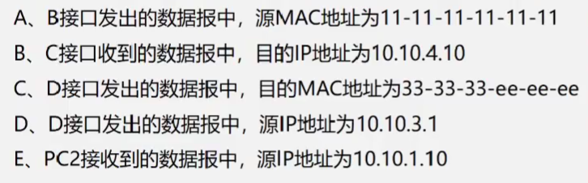{:width=150 height=150}
- BCE
##### 路由器NAT转换
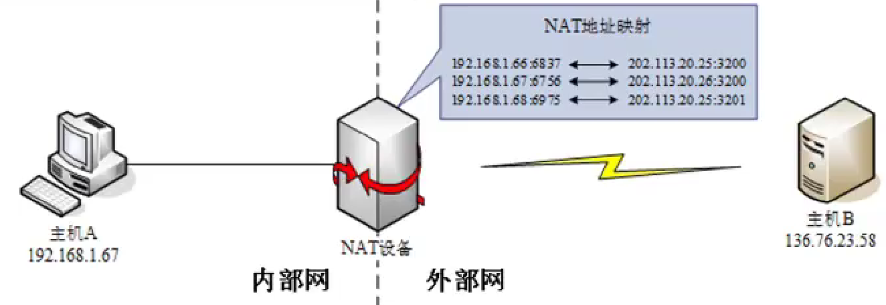{:width=300 height=300}
表中左侧是内网地址，右侧是全局IP
先在NAT映射中根据主机A的内网IP`192.168.1.67`找到它对应的全局IP，即`202.113.20.26`
- 主机A接收数据报的
  - 源地址：主机B的IP
  - 目的地址：主机A的内网IP
- 主机B接收数据报的
  - 源地址：主机A的全局IP
  - 目的地址：主机B的IP
- NAT向主机A发送数据报的
  - 目的地址：主机A的内网IP

对于主机A：A的内网IP<->主机B
对于主机B：主机B<->A的全局IP

---

路由器接收到源地址为`10.1.0.35`，目的地址为`10.4.0.78`的IP数据时，应将数据投递到？
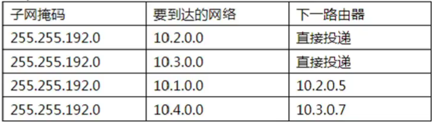{:width=150 height=150}
根据子网掩码和要到达的网络这两列，求出对应的网络地址，判断目的地址`10.4.0.78`属于哪个路由器，这里显然是`10.4.0.0`的那个，它对应的下一路由器`10.3.0.7`即为结果；如果是直接投递，就是投递到目的地址

---

到达哪些目的网络的表项将出现在更新后的路由表中
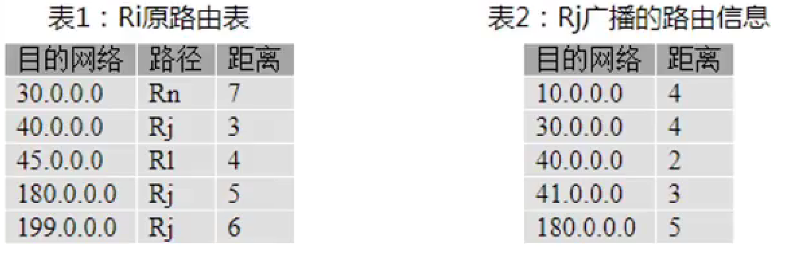{:width=150 height=150}
- 比较两个表中的目的网络，看Rj表中有哪些是新增的（哪些是Ri表中没有的），把这些新增的目的网络写到更新后的路由表中，距离就直接是Rj表中的
- 再找既在Ri又在Rj表中的网络，写到更新后的路由表中，距离是`min(Rj+1, Ri)`
  - 特殊情况：如果某个网络在Ri和Rj表中距离相同，且Ri的路径是Rj，距离就是`Rj+1`
- 对于只在Ri表的网络，如果它的路径是Rj，就舍弃；如果不是Rj，就连同距离一起写到更新后的路由表中

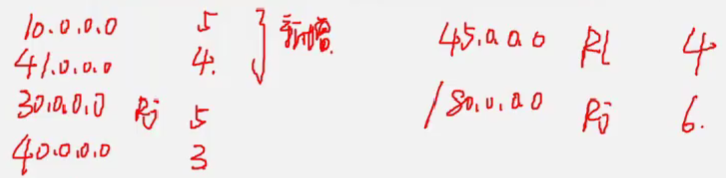{:width=150 height=150}
##### ARP缓存
例1：主机`192.168.4.10`的缓存表如图，此时该主机向哪些主机发送时，不需要发送ARP请求
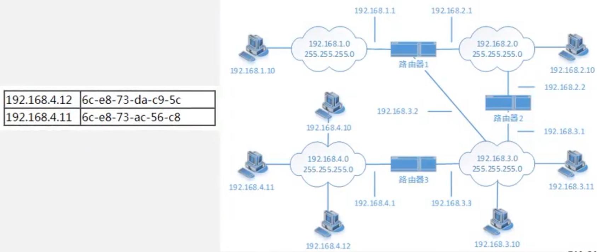{:width=300 height=300}
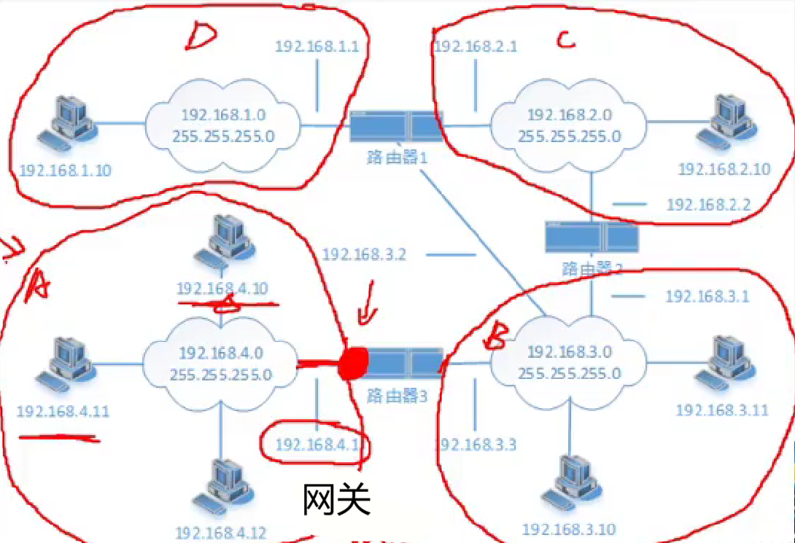{:width=400 height=400}
- 缓存表中有的地址不需要发送
- 如果缓存表中有网关地址，则所有外网主机都不需要发送
- 此题选择AB

例2：主机`192.168.4.10`
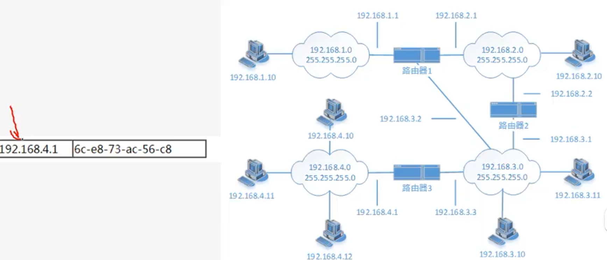{:width=300 height=300}
- 缓存表里是网关地址
- 此题选择CDE
##### 路由协议
**RIP**：
- **动态**环境
- 小型网络（最大15跳）
- **向量-距离算法**(V-D)

**OSPF**：比RIP收敛更快
- **动态**环境
- 大型网络（多路径环境）
- **链路-状态算法**
##### 其它
**IP服务特点**：
- 不可靠
- 无连接
- 尽最大努力

**IP协议**：
- 运行于**互联层（网络层）**，向传输层提供统一服务
- 屏蔽不同物理网络差异
- **与“帧”无关**

**IP互联网**：
- 使用路由器连接不同物理网络 
- 隐藏**低层网络**细节（**不是传输层**）
- **不指定拓扑结构，不要求全互联**
- **平等，无优先级**
- 使信息跨越物理网络（跨子网）
- 主机使用**统一的地址描述法**，不是物理地址表示法

**非对称数字用户线ADSL**：
- 上/下行传输速率不同（非对称）
- 调制解调
- **电话网/电话线路**
- 适合家庭用户

**光纤同轴电缆混合网HFC**：
- 上/下行传输速率不同（非对称）
- 调制解调
- **电视网**
- 共享信道
### Internet基本服务
**P2P网络**：分布式（非）结构化、集中式、混合式
- 分布式结构化
  - 基于**DHT**（分布式散列表）
  - 仅支持**精确关键词匹配查询**
  - 软件包括Pastry、Tapestry、Chord、CAN
- 分布式非结构化
  - 基于**随机图**
  - **洪泛方式**查询，支持**复杂查询**
  - 每个节点既是客户机也是服务器（对等点）
  - 软件包括Gnutella、Shareaza、LimeWire、BearShare
- 集中式
  - **中心服务器保存索引信息**
  - **服务器只存储目录和索引**
- 混合式：用户、搜索、索引节点
  - **搜索节点不保存索引节点信息**
  - **索引节点保存搜索节点信息**

**Web浏览器**：由一个**控制单元**和一系列**客户单元**、**解释单元**组成
- **控制单元：接收并解释用户的键盘和鼠标输入**
- **客户单元：发送Http请求信息**
- **解释单元：将请求返回的页面翻译成Web浏览器能够显示的内容**

**Web服务**：
- 最早由Tim-Lee开发
- Mosaic是第一个图形界面Web浏览器
- 采用客户机/服务器工作模式
- **需要实现HTTP传输协议**
  - 是**浏览器和服务器**的传输协议
  - **TCP**
- 符合HTML规范

**Http报文**：
- **请求**：包括一个**请求行**和若干个**报头行**，有时还有报文体，报头和报文体以空行分隔
- **应答**；包括一个**状态行**和若干个**报头行**，报头和报文体也是以空行分隔，**状态码3位数字**

**域名解析**：
- **域名解析器：请求域名解析的软件**
- 解析方式：**递归解析**、反复解析
- 需借助一组域名服务器，解析一般**从本地域名服务器开始**
  - **逻辑结构为树型**
- 提高效率的方式：
  - 解析从**本地域名服务器**开始
  - 在本地主机/域名服务器上使用**高速缓冲技术**

**Telnet**：远程操控/登录（不是下载）
- 是Internet最早提供的服务之一
- **使本地主机成为远程主机的仿真终端**
- 采用客户机/服务器工作模式（不是对等计算）
- 使用**NVT屏蔽不同用户终端输入差异**
  - 如果选项中是“屏蔽键盘输入的差异”，无论单选多选都算对
  - 如果选项中是“屏蔽键盘解释的差异”，
    - 单选时要看其它选项，如果其它选项有对的就不选它，没有对的才选它
    - 多选中算错

**响应消息的开始字符串**：
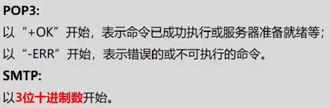{:width=150 height=150}
**FTP协议两种传输方式**：
- **文本文件**（各种文档）：**可能**会对文件进行修改
- **二进制文件**（图片音乐等）：**不会**对文件进行修改

**FTP协议两种数据连接方式**：主动与被动
### 新型网络应用
**即时通信系统**：（PPBB XJ）
- Mirabils最早推出的ICQ
- 模型框架：RFC2778
- 三种IM协议：
  - 微软的MSN：MSNP
  - AOL：OSCAR（AO-OA）
  - QQ：私有协议
- 通用协议：都是**应用层**协议
  - simple协议簇：SIP架构，是sip的扩展
  - XMPP协议簇：Jabber架构，使用XML技术，**比simple扩展性强**
- 两种服务：**呈现服务**和**即时消息服务**
  - 呈现服务：用户之间相互订阅并获取彼此的状态变更信息
  - 即时消息服务：用户之间相互收发消息
- 两类呈现客户：**呈现者**和**观察者**
  - 呈现者：提供存储和发布的呈现信息
  - 观察者：从呈现服务接收呈现信息
- 两种模式：**用户/用户模式**和**用户/服务器模式**（需要中间服务器的转发）

**SIP系统**：会话发起协议
- 用户标识：类似于邮箱地址`a@b.c`
- 4种元素：**用户代理**、**代理服务器**、**重定向服务器**、**注册服务器**
  - **用户代理**：**分为UAC和UAS**，UAC发起请求，UAS回应请求
  - 代理服务器：转发请求，分为有状态和无状态
  - 重定向服务器：规划路径，**可与其它服务共存于一个设备**
  - 注册服务器：处理用户地址的注册
- **可经过多个代理服务器**
- **不依赖特定承载网络**
- 会话**其中一方发送INVITE**消息即可
- **不只TCP**

**SIP消息**：
- 分为**请求**和**回应**两类
- 消息头和消息体通过**空行**分隔
- 起始行分为**请求行**（请求消息）和**状态行**（回应消息）
- 6种请求消息：

| SIP请求方法 | 功能                                                          |
| ----------- | ------------------------------------------------------------- |
| INVITE      | **邀请用户参加会话**                                          |
| ACK         | 和INVITE一起使用 证实收到INVITE请求响应（**不是bye响应**） |
| OPTION      | 请求服务器**能力**的信息                                      |
| BYE         | 终止会话，包含消息头，双方都可发起                            |
| CANCEL      | 取消挂起的呼叫                                                |
| REGISTER    | 向定位服务器注册UA信息                                        |

**XMPP**：
- 使用XML技术/数据格式（不是局部寻址）
- 不兼容其它系统
- **XMPP地址/用户标识/实体地址：JID**
- 包括Jive Messager和Google talk

**QQ**：
- 闭源
- **首次登录一定需要DNS服务**，下一次可以不用
- 好友列表：在用户端和服务器端都有
- 聊天信息：加密，不是明文，密钥由服务器提供
- 即时消息传送/文件传输：即可采用用户/用户模式，也可采用用户/服务器模式

**BitTorrent**：
- 基于**MIT**授权的开源
- **种子文件**（后缀为`.torrent`）包含**Tracker服务器**的相关信息、文件信息、发布者信息，让想要下载该文件的用户不一定非要从该文件的发布者下载，可以从其它所有已下载该文件的用户端下载
- Tracker服务器不保存文件，而是作为路标，具体文件保存在用户端

**Maze**：
- 混合**P2P结构**
- 采用**类似url**表示文件位置
- **分布式**认证方式
- 必备服务器：**索引和检索**服务器、**文件目录**服务器、**心跳**服务器、**用户管理**服务器
- 功能：
  - 支持资源搜索
  - 文件目录视图（目录浏览功能）
  - 基于积点的资源交易体系

**搜索引擎**4个关键部分：搜索器、索引器、检索器、用户接口
- 搜索器：提取输入中关键字，**访问Web站点**采集网页信息
- 索引器：**理解文档**，在服务器上查找与关键字有关的内容，生成文档库的索引表
- 检索器：在索引库中**找到文档**
- 用户接口：输入查询内容，**显示查询结果**

**VOD**：IPTV中的视频点播
- 分类：nti
  - **就近式点播电视(NVOD)：最近的**
  - 真实点播电视(TVOD)
  - **交互式点播电视(IVOD)：传统录像机**
- 组成部分：
  - 节目制作中心：节目的采集、压缩、编辑
  - 视频服务器：实时技术，向客户端实时地传输数字视频节目
  - 视频节目库：存储
  - 管理服务器：根据用户级别提供登录界面，管理客户和视频间的关系
  - 客户端
- 两个技术：
  - 媒体内容分发技术(MCDN)：降低带宽资源浪费
    - 内容发布：**发布视频内容**到距用户最近的服务点
    - 内容交换：根据可用性在**应用层**交换
    - 内容路由：为用户提供最近的**源响应**
    - 性能管理：测量端端**性能**，同时获取网络状态信息
    - IP承载网
  - 版权管理技术：数据加密（数字签名）、数字水印、版权保护

**VoIP**：网络电话（IP电话）
- PC/Phone/Pad间都可以互相通信（只要能联网就行）
- 4个基本组件：
  - **终端设备**：通过电话网连接到IP电话网关，不一定是专用电话，还可以是软件
  - **IP电话网关**：通过Internet与另一个IP电话网关连接，进行号码查询，建立通信连接，信息调制与解调/压缩和解压，路由寻址
  - **网守**：消息控制中心，包括监控网络、平衡负载、管理带宽、提供系统接口、身份验证与注册（管理终端用户）、**呼叫控制与授权**、**确定网关地址**、计费、保存记录
  - **多点控制单元(MCU)**：利用IP网络实现多点通信（小型会议）
### 网络管理与安全
##### 网络管理
**5大功能：配置、故障、记账、性能、安全管理，没有密钥和证书**
**性能管理**：
- 测试网络运行中的性能指标，检验网络服务是否达标
- 两部分：
  - 性能监控：收集网络状态信息
  - 网络控制：采取措施改善性能

**故障管理**：
- 发现和解决网络故障，保证网络连续可靠
- 主要内容：故障监测/记录/跟踪/诊断/恢复，维护错误日志，发布故障事件报告（不是安全事件）
- **不收集**

**配置管理**：
- 实现网络设备的配置与管理，设备参数与设备间的连接
- 可能是临时或永久的，支持对变化的响应
- 主要内容：标识网络中被管对象（初始化/关闭）、识别网络拓扑结构、修改设备配置
- **不状态 不统计**

**网络管理**：**应用层**
- 对象包括**用户所有密码**
- **管理器和代理是一对多**
- SNMP：**比cmip更简单，不配合使用，没有复杂性**
  - 用于**TCP/IP（不是只）**
  - **采用轮询/trap机制**
  - 采用**IETF**协议
  - 共3个版本，**第一版安全性差**，**v3改进安全性**
  - **RMON**提供补充功能
  - 管理信息库(MIB)存在于管理站和代理中，**代理可查询MIB**
- CMIP：
  - 用于**OSI**
  - 采用**委托监控机制**
  - 采用**ISO**协议
  - **通过ROP实现时间报告**
  - **不平等**
  - **CMIS定义服务原语**
##### 网络安全与加密
**可信计算机评估准则**：美国制定，不是IETF
- 安全级别从低到高：D->C1->C2->B1->B2->B3->A1
- **D：非安全保护类型**，不要求审计
- **C：自主保护类型**，数据保护以用户组为单位
- **B：强制保护类型**，**B3开始有安全内核**

**网络攻击类型**：
- 主动与被动：是否产生伤害
  - 被动攻击：以收集信息为目的，难以察觉，包括嗅探、漏洞扫描、信息收集/监听/分析、截获密码
    - **截获密码**、**监听信息**、**进行网络分析**
  - 主动攻击：不仅搜集信息，还进行破坏，包括**拒绝服务**、信息窃取/篡改、**欺骗**攻击、**邮件炸弹**、**源路由攻击**
    - 篡改：修改或插入
    - 重放：延时
    - 伪造：冒充
    - 拒绝服务：消耗被攻击者的资源
- 服务与非服务：是否攻击服务器
  - 服务攻击：攻击Email/FTP/Web/DNS服务器，使服务器工作异常，包括**邮件炸弹**、**对服务器端口攻击**
  - 非服务攻击：不针对具体服务，而是针对网络设备或通信线路（路由器、交换机、网关、防火墙），包括地址欺骗、Sniffer攻击

**数据加密标准**：dsa/rsa/elgamal是公钥加密  des和是对称加密
- **DES**：
  - 由IBM提出，经**ISO认定**的**对称**加密算法（公钥）
  - **分组密码**，每次处理一个64位的明文分组，生成一个64位的密文分组（置换与代换），每轮置换函数相同
  - 密钥长度**64位**（8位奇偶校验、56位用户使用）
  - 注：任何加密算法都不能确保绝对安全
- **RSA**：
  - 由**Rivest**、Shamir、Adleman设计，**非对称**加密算法
  - 理论基础：寻找大素数，安全性以大素数分解为基础
  - 密钥长度可变(512/1024/2048)，长密钥增强安全性，短密钥提高加密速度（**加密强度取决于密钥长度**）
  - 数字签名：既使用对称加密，又实用非对称加密
##### 各种协议
**SSL协议**：443端口，url以https开头
- 可用于HTTP、FTP、TELNET等
- 处于应用层与传输层间（工作在传输层）
- 两个协议：SSL握手协议、SSL记录协议
- 由Netscape开发，因为与微软开发的PCT不兼容，所以产生了TLS

**TSL协议**：
- 由IETF制定
- 工作在传输层
- 两个协议：TSL握手协议、TSL记录协议
- 与SSL功能类似：在两个通信应用程序间提供保密性和数据完整性，可用于HTTP、FTP、TELNET等

**PGP协议**：
- 针对邮件，用于电子邮件加密、身份认证、数字签名，保证数据传输安全
- 工作在应用层
- 支持数据加密（各种协议都支持），同时使用对称加密（内层）和非对称加密（外层）

**SET协议**：
- 针对电子商务（一种基于浏览器/Web服务器的工作模式），需要认证中心支持
- 除了对称/非对称加密，还使用了数字信封、数字签名、信息摘要技术、双重签名技术

**S/MIME协议**：
- 由IETF制定
- 针对组织和商业使用的工业标准，用于数据保密、完整性保护、认证和鉴定服务、数字签名
- 既支持Windows，也支持iOS

**防火墙**：
- 位于内网外网之间，保证内网安全
- 可通过软件实现，在硬件设备上使用
- 使用包过滤技术（屏蔽路由器）和应用级网关技术，简单的只有包过滤路由器
  - **包过滤路由器：IP数据报**，检查部分或全部报头内容，包括**源目的IP地址**、**协议类型**、IP选项、**源/目的端口号**、TCP/ACK标识

**IDS/IPS**：
- **入侵检测系统(IDS)**：检测网络攻击，**发现可能存在的攻击行为**，包括**内部外部**的攻击行为、非授权行为等
- **入侵防御系统(IPS)**

**计算机病毒**：
- **网络蠕虫**：通常是独立程序，可独立传播，常利用漏洞传播，早期利用电子邮件传播
- **木马**：不是独立程序，没有自我复制和独立传播能力
